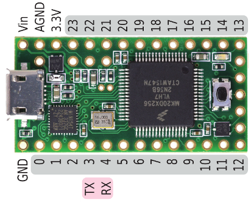
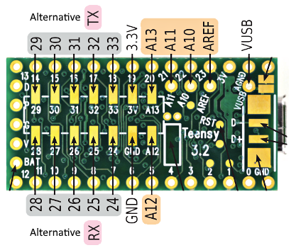
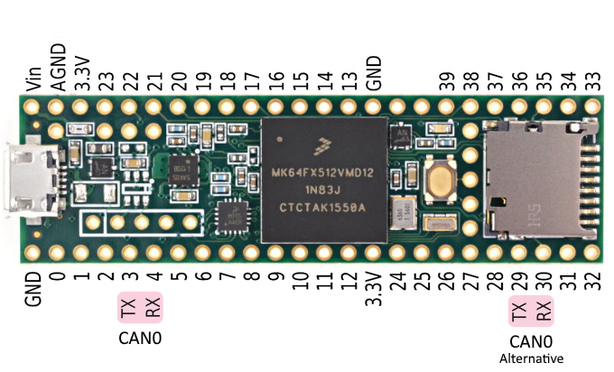
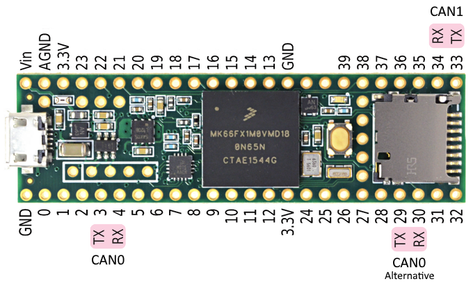

This is a fork of [H4nky84/FlexCAN_Library](https://github.com/H4nky84/FlexCAN_Library), renamed so that other incompatible forks will not accidentally get compiled.

## CANbus Library for Teensy 3.1, 3.2, 3.5 and 3.6

### Introduction
FlexCAN is a serial communication driver for the CAN peripherial built into the Teensy CPUs. Versions 3.1, 3.2 and 3.5 of the board support single CAN0 controller while version 3.6 supports dual CAN0/CAN1 controllers.  The driver is organized in the Arduino library format.

When the FlexCAN object is constructed on Teensy 3.1/3.2, Arduino pins Digital 3 and Digital 4 (or alternatively Digital 32 and Digital 25) are assigned to CAN functions TX and RX.

 

Similarily on Teensy 3.5, the same Arduino pins Digital 3 and Digital 4 (or alternatively Digital 29 and Digital 30) are assigned to CAN functions TX and RX.

On Teensy 3.6 it is possible to to specify the **id** parameter and select whether CAN0 or CAN1 shall be used. For CAN0 Arduino pins Digital 3 and Digital 4 (or alternatively Digital 29 and Digital 30) are assigned to CAN functions TX and RX. For CAN1 Arduino pins Digital 34 and Digital 33 are assigned to CAN functions TX and RX.

CAN RX and TX pins should be wired to a 3.3V CAN transceiver TXD and RXD respectively to allow connection of the Teensy 3.1/3.2/3.5/3.6 to a CAN network.

Even though the Teensy 3.1/3.2/3.5 is operating on 3.3V, use of 5V transceivers may be an option if the system has regulated +5V available.  The CAN RXD input on the CPU is 5V tolerant and most 5V transceivers will accept the 3V TXD signal.  This is a good choice for breadboarding due to availability of thru-hole 5V transceiver parts.
**In case of Teensy 3.6 the digital pins are not 5V tolerant, so 3.3V transceivers must be used!**

Note that CAN will normally require termination resistors.  These are located at the two ends of a CAN bus to prevent reflections.  Do not add more terminators when connecting devices to an existing properly terminated CAN bus.

Supported baud rates are 50000, 100000, 125000, 250000, 500000, and 1000000 bits per second.  If the baud rate is not specified it will default to 125000.

### CAN Transceiver Options
Please add parts you are using successfully with Teensy 3.1 to this list.
- TI SN65HVD230D on 3.3V (1MBPS)
- TI SN65HVD232D / SN65HVD232QDQ1 on 3.3V (1MBPS)
- NXP TJA1050T/VM,118 on the same 5V supply as the Teensy. (1MBPS)
- Microchip MCP2551 on 5V (reported at 500KBPS)
- Linear LT1796 on 5V (not speedtested)
- Microchip MCP2562 with VIO on 3.3V (tested on Teensy 3.2 and 3.6)

### Driver API
**FlexCAN(baud, id, txAlt, rxAlt)**
Create the FlexCAN object. The table below describes each parameter together with allowed values. Defaults are marked **bold**. When a non-allowed value is used default will be taken instead.

| Parameter | Description          | Allowed values 
|-----------|----------------------|----------------------------------------------------------------------------
| baud      | baudrate [bps]       | Teensy 3.1/3.2/3.5/3.6: 50000, 100000, **125000**, 250000, 500000, 1000000
| id        | FlexCAN interface ID | Teensy 3.1/3.2/3.5: **0** (CAN0) Teensy 3.6: **0** (CAN0), 1 (CAN1)
| txAlt     | Alternative TX pin   | Teensy 3.1/3.2: **0** (PIN3), 1 (PIN32) Teensy 3.5/3.6 CAN0: **0** (PIN3), 1 (PIN29) Teensy 3.6 CAN1: **0** (PIN33)
| rxAlt     | Alternative RX pin   | Teensy 3.1/3.2: **0** (PIN4), 1 (PIN25) Teensy 3.5/3.6 CAN0: **0** (PIN4), 1 (PIN30) Teensy 3.6 CAN1: **0** (PIN34)

**begin()**
Enable the CAN to start actively participating on the CANbus.

**end()**
Disable the CAN from participating on the CANbus.  Pins remain assigned to the alternate function CAN0.

**write(message)**
Send a frame of up to 8 bytes using the given identifier.  **write()** will return 0 if no buffer was available for sending (see "Caller blocking" below).

message is a **CAN_message_t** type buffer structure.

**read(message)**
Receive a frame into "message" if available.  **read()** will return 1 if a frame was copied into the callers buffer, or 0 if no frame is available (see "Caller blocking" below).

**available()**
Returns 1 if at least one receive frame is waiting, or 0 if no frame is available.

### Use of Optional RX Filtering
**begin(mask)**
Enable the CAN to start actively participating on the CANbus.  Enable reception of all messages that fit the mask.  This is a global mask that applies to all the receive filters.

**setFilter(filter, number)**
Set the receive filter selected by number, 0-7.  When using filters it is required to set them all. If the application uses less than 8 filters, duplicate one filter for the unused ones.

The mask and filter are **CAN_filter_t** type structures.

### Caller Blocking Support
Support has been included for wait / blocking in both the **read()** and **write()** calls.

When the **CAN_message_t** field **timeout** is given, the **read()** and **write()** calls will wait if needed until the frame transfer can take place. The maximum wait for transfer is specified by **timeout** in milliseconds. If the call times out, it will return 0 as in the non-blocking case.

Setting the timeout field to 0 will make the calls non-blocking.

The timeout monitoring mechanism calls **yield()** until a buffer is found or the timeout time is exceeded.

### In-order Transmission
Caller blocking can be used to **write()** frames guaranteed in-order to the bus. When caller blocking is selected for **write()** (non-zero timeout specified), a single hardware transmit buffer is used.

